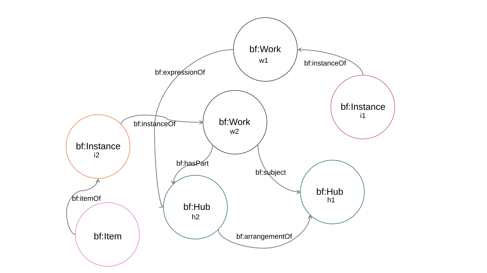

# BIBFRAME and Content Models (such as RDA)

The challenge, therefore, for the various communities that compose the library and information science space is to take the largely unconstrained BIBFRAME vocabulary and its simple, yet flexible, model and determine how best to leverage them for their chosen content models.

In libraries, the Resource Description and Access (RDA) content model is the principal means by which to describe content. RDA, however, abstracts resources into four different parts – called Works, Expressions, Manifestations, and Items - making RDA considerably more complex than BIBFRAME and, likewise, removed from how many perceive of these resources in real life. RDA can also be rigid in that it functions better for resources described now and into the future versus accommodating of past cataloging practices. All of these aspects have posed challenges for BIBFRAME that have been partially addressed by the addition of two important classes or resources to the BIBFRAME model and vocabulary: Hubs and Items.

If BIBFRAME Works represent concepts or small abstractions, Hubs are intentionally abstracted bibliographic resources. They can align with any types of abstract resources past or present in bibliographic data. Hubs are designed mainly as resources for aggregation and collocation, taking over the role of traditional “access points” in historical library cataloging. But they can be leveraged to represent RDA Works or RDA (Representative) Expressions also.

The BIBFRAME model and vocabulary, from its very initial inception in 2012, has always been able to accommodate the concept of an “item” but its naming was unclear. The Item class, or resource, was added to the BIBFRAME model and vocabulary explicitly for the sake of clarity. It therefore has the distinction of being the one class that shares a name and conceptual purpose with a principal RDA entity, even though it is a resource and concept needed by other content models.

The lack of pure overlap in entity naming between BIBFRAME and RDA, as well as the differing definitions, concepts, and expected uses of the four “big” BIBFRAME entities – Work, Instance, Hub, and Item – is intentional. One of the main objectives with the BIBFRAME model and vocabulary is to keep it at a safe remove from any single content model, while providing enough hooks to allow for individual content models to use BIBFRAME to express their data.

To this end, BIBFRAME embraces a graph approach to curating bibliographic descriptions. Graph data provide not only the greatest flexibility but also best reflect the world of rich, sometimes surprising, relationships found in bibliographic data. Importantly, this flexibility doesn’t preclude other content models, especially those that take a more hierarchical approach to bibliographic data.

---

[Back to Table of Contents](index.md)

[Previous Page: Data Model Overview](data-model-overview.md) | [Next Page: Relationship to MARC](relationship-to-marc.md)
